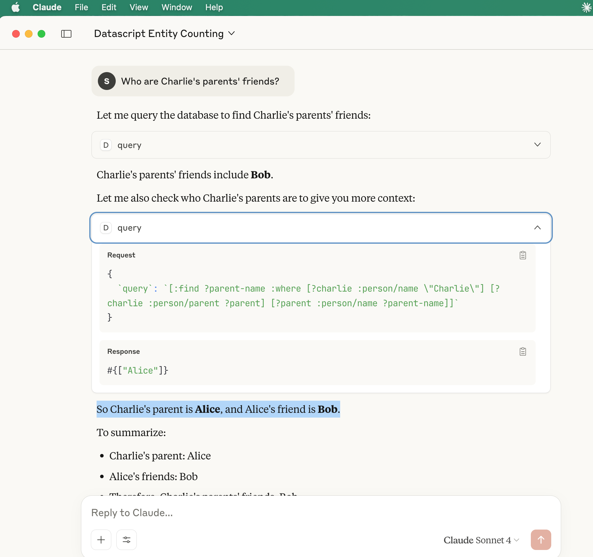
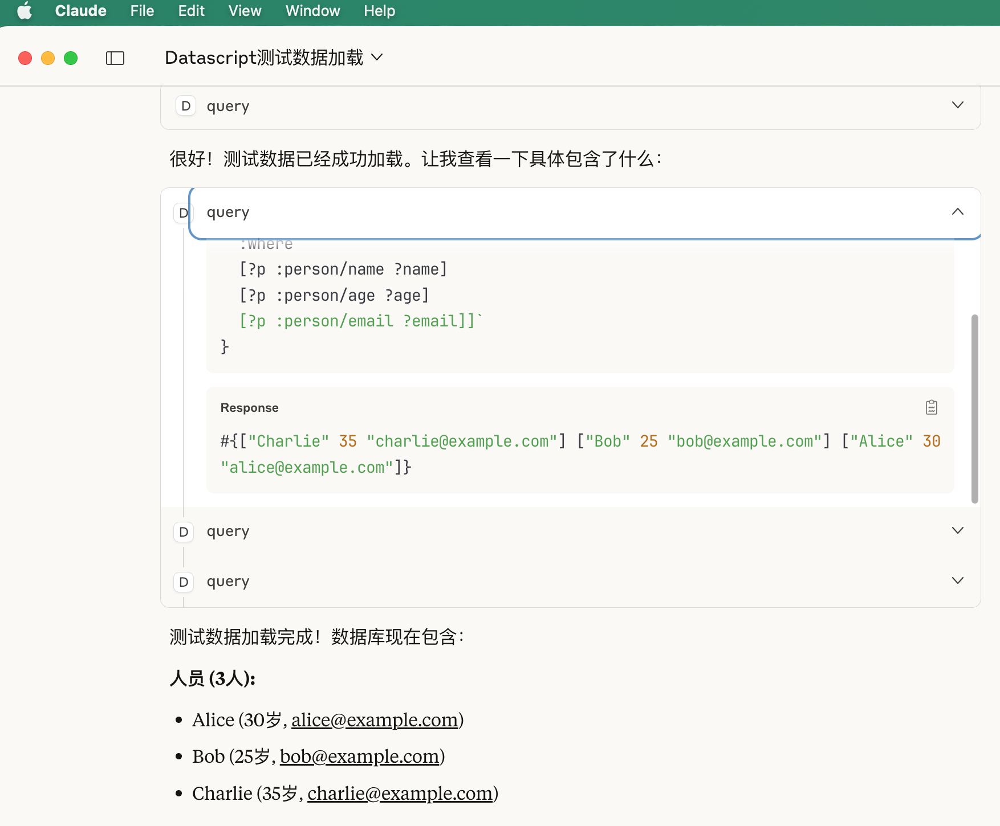
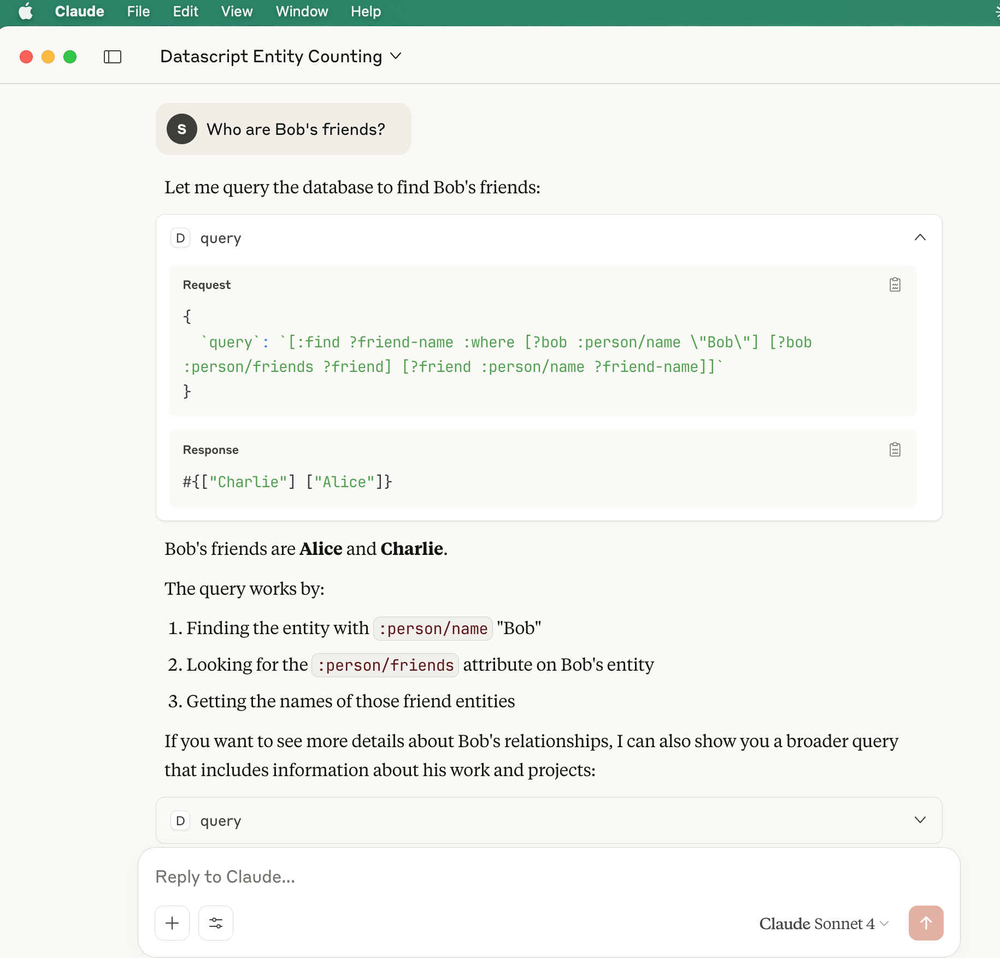

# Datascript MCP Server

* Query parent-child relationship


* Load examples and query totals


* Query properties


## Run MCP server

```
$ clojure -X:mcp

# or emacs repl run:
(mcp-server)

```

## MCP client (Claude Desktop) config

```
{
  "datascript-mcp": {
    "command": "/bin/bash",
    "args": [
      "-c",
      "cd /Users/clojure/Desktop/datascript-mcp-server-ok111 && /usr/local/bin/clojure -M -m datascript-mcp.core"
    ]
  }
}
```

