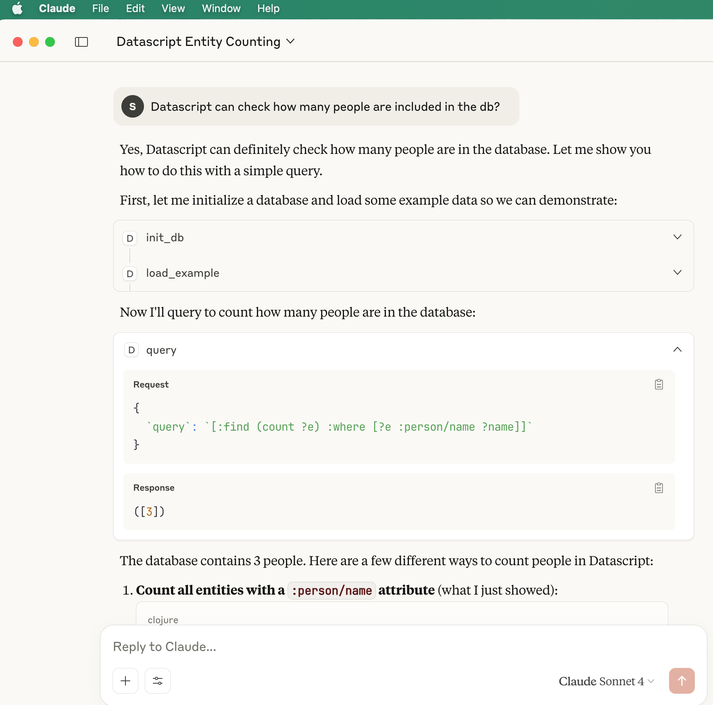

# Datascript MCP Server

* Query parent-child relationship


* Load examples and query totals


* Query properties


## Run MCP server

```
$ clojure -X:mcp

# or emacs repl run:
(mcp-server)

```

* Check whether the mcp server is serving normally

```
$  echo '{"jsonrpc": "2.0", "id": 1, "method": "initialize", "params": {"protocolVersion": "2024-11-05", "capabilities": {}, "clientInfo": {"name": "test", "version": "1.0"}}}' | /usr/local/bin/clojure -M -m datascript-mcp.core

Datascript MCP Server running on STDIO transport.
{"jsonrpc":"2.0","method":"notifications/tools/list_changed"}
{"jsonrpc":"2.0","method":"notifications/tools/list_changed"}
{"jsonrpc":"2.0","method":"notifications/tools/list_changed"}
{"jsonrpc":"2.0","method":"notifications/tools/list_changed"}
{"jsonrpc":"2.0","method":"notifications/tools/list_changed"}
{"jsonrpc":"2.0","method":"notifications/tools/list_changed"}
{"jsonrpc":"2.0","method":"notifications/tools/list_changed"}
{"jsonrpc":"2.0","id":1,"result":{"protocolVersion":"2024-11-05","capabilities":{"logging":{},"tools":{"listChanged":true}},"serverInfo":{"name":"datascript-server","version":"0.1.0"}}}

```
## MCP client (Claude Desktop) config

```
{
  "datascript-mcp": {
    "command": "/bin/bash",
    "args": [
      "-c",
      "cd /Users/clojure/Desktop/datascript-mcp-server-ok111 && /usr/local/bin/clojure -M -m datascript-mcp.core"
    ]
  }
}
```

