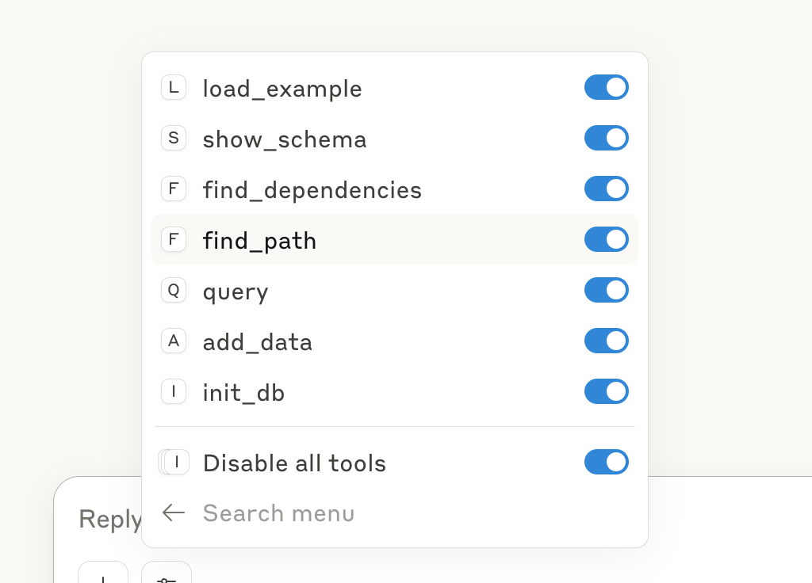

# 🚀 Datascript MCP Server

**Query. Visualize. Extend. AI.**
A powerful Clojure-based MCP server built for querying DataScript and integrating with AI workflows.

---

## 🔍 Key Features

### 🕸️ Graph path search and visualization

* Datascript MCP Server + [Visualization MCP Server](https://github.com/xlisp/visualization-mcp-server)


### 📂 Query parent-child relationships


### 📊 Load examples and compute totals


### 🧾 Query entity properties


---

## ⚙️ Getting Started

### ▶️ Run the MCP Server

Run with Clojure CLI:

```bash
clojure -X:mcp
```

Or from Emacs REPL:

```clojure
(mcp-server)
```

---

### ✅ Check Server Health

Use the following command to verify that the server is up and responding to JSON-RPC:

```bash
echo '{"jsonrpc": "2.0", "id": 1, "method": "initialize", "params": {"protocolVersion": "2024-11-05", "capabilities": {}, "clientInfo": {"name": "test", "version": "1.0"}}}' \
| /usr/local/bin/clojure -M -m datascript-mcp.core
```

Expected response:

```
Datascript MCP Server running on STDIO transport.
{"jsonrpc":"2.0","method":"notifications/tools/list_changed"}
...
{"jsonrpc":"2.0","id":1,"result":{"protocolVersion":"2024-11-05","capabilities":{"logging":{},"tools":{"listChanged":true}},"serverInfo":{"name":"datascript-server","version":"0.1.0"}}}
```

---

## 🖥️ MCP Client Configuration (Claude Desktop)

Example client setup for launching the server from Claude Desktop:

```json
{
  "datascript-mcp": {
    "command": "/bin/bash",
    "args": [
      "-c",
      "cd /Users/clojure/Desktop/datascript-mcp-server && /usr/local/bin/clojure -M -m datascript-mcp.core"
    ]
  }
}
```

* Tools


---

## 🔮 Roadmap

1. **Import and query any DataScript dataset**
2. **Generate and insert AI-created data on the fly** 👉 `add_data`
3. **Connect to Datomic for hybrid querying**
4. **Visualize relationship graphs and entity networks** 👉 [Visualization MCP Server](https://github.com/xlisp/visualization-mcp-server)
5. **Support filesystem help** 👉 [filesystem-mcp-server](./src/datascript_mcp/filesystem.clj), `clojure -X :mcp-filesystem`
6. **Support Datahike's MCP**

---

## Contributing

1. Fork the repository
2. Create a feature branch (`git checkout -b feature/amazing-feature`)
3. Commit your changes (`git commit -m 'Add amazing feature'`)
4. Push to the branch (`git push origin feature/amazing-feature`)
5. Open a Pull Request

---

## License

This project is licensed under the MIT License - see the [LICENSE](LICENSE) file for details.

---

**Built with Clojure. Powered by DataScript. Inspired by the future of intelligent querying.**
*In the Source we trust.*
